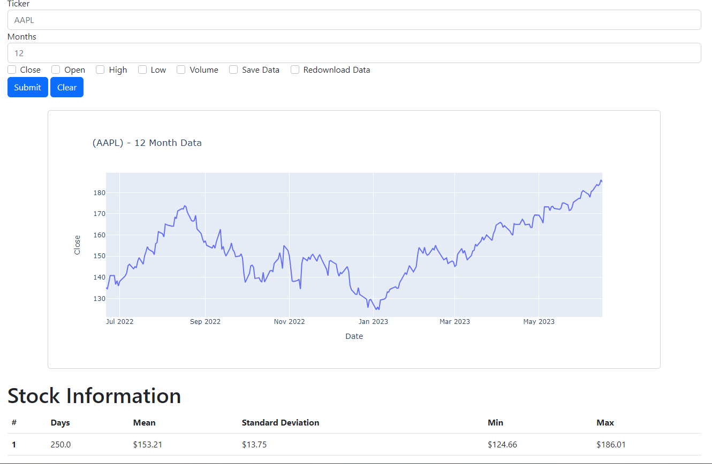

# Market Analysis
Flask Python project for analyzing stocks.

This project utilizes [Plotly](https://plotly.com/python/) to generate charts and Flask to render page templates.

### Saving stock information
The stock data can be read using [yfinance](https://pypi.org/project/yfinance/) or the data can be saved in a CSV file and read using [Wrangles](https://pypi.org/project/wrangles/)

The Data files are saved in the root folder called **data**.